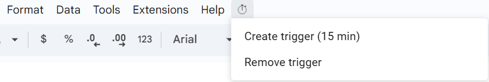

# 🚀 Installation

### Step 1 – Add the Script

1. In Google Sheets, open **Extensions → Apps Script**.
2. Download and paste the full script from the [Latest Release](https://github.com/lorenzodotta02/Finance-functions-for-Google-Sheets/releases).

### Step 2 – Add the CoinMarketCap API Key (optional)

Required only for `CRYPTOPRICE`.

1. In the Apps Script editor, go to **Project Settings (⚙️)** → **Script Properties** → **Add Property**.
2. Create a new property with:
    - **Property (key):** `CMC_API_KEY`
    - **Value:** *your CoinMarketCap API key*
3. Save the property.

### Step 3 – Activate the Script

1. **Save and reload** your Google Sheets page.
2. A new custom menu will appear in the toolbar (see below).
    - Click **⏱ → Create trigger (15 min)** to enable automatic updates.
    - Accept all authorization requests that appear — these are required for the script to run correctly.
    - You can later select **Remove trigger** to disable it.
    
    
    
3. Once the trigger is active, you can use the functions directly in your sheet.
