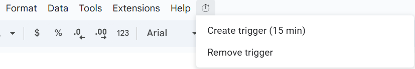

# Finance functions for Google Sheets

A collection of **custom Google Sheets functions** that extend the limited `GOOGLEFINANCE` functionality.

These functions fetch/scrape **real-time or near real-time financial data** — including bonds, ETFs, crypto, and commodities — from multiple APIs and websites.

Currently supported data types:

- **Bonds** → Any bond available on *Borsa Italiana*
- **ETPs** → Any ETP (ETF/ETC/ETN) available on *JustETF*, priced in EUR (exchange may vary: Xetra, LSE, etc.)
- **Crypto** → Any cryptocurrency listed on *CoinMarketCap* via their official API
- **Commodities** → Spot prices (Gold, Silver, Platinum, Palladium in EUR per gram)

---

## ⚙️ Custom Functions Overview

| Function Name | Description |
| --- | --- |
| `ETPPRICE(dateCell; isin)` | Returns the latest price for the specified ETP (from JustETF). |
| `BONDPRICE(dateCell; isin)` | Returns the latest price of a bond using the provided ISIN. |
| `CRYPTOPRICE(dateCell; symbol)` | Returns the latest price of a cryptocurrency using the CoinMarketCap API. |
| `COMMODITYPRICE(dateCell; name)` | Returns the latest spot price of a commodity. |

> Note: dateCell must always be Utils!$A$1.
> 
> 
> This reference cell is automatically updated by the script every 15 minutes and is used to **force a recalculation** of your custom functions whenever its value changes.
> 
> ⚠️ **Important:** The functions use a semicolon (`;`) as the argument separator (e.g., `=ETPPRICE(Utils!$A$1; "IE00BK5BQT80")`) because the Google Sheets locale is **European.**
> 
> If you are using the **U.S. locale**, replace `;` with a comma (`,`).
> 

---

## 📌 Example Functions

```
=ETPPRICE(Utils!$A$1; "IE00BK5BQT80")     // Returns the price of VWCE
=BONDPRICE(Utils!$A$1; "IT0005433195")    // Returns the price of BTP Tf 0,95% Mz37 Eur
=CRYPTOPRICE(Utils!$A$1; "BTC")           // Returns the price of Bitcoin
=COMMODITYPRICE(Utils!$A$1; "Gold")       // Returns the price of Gold (EUR/gram)
```

---

# 🚀 Installation

### Step 1 – Add the Script

### Option 1 – Manually via Google Apps Script

1. In your Google Spreadsheet, go to **Extensions → Apps Script**.
2. Copy and paste the contents of the files from the `src/` folder into the script editor.

### Option 2 – Use the Latest Release File

1. In your Google Spreadsheet, go to **Extensions → Apps Script**.
2. Download and paste the single consolidated script file from the [Latest Release](https://github.com/lorenzodotta02/Finance-functions-for-Google-Sheets/releases).

### Step 2 – Add the CoinMarketCap API Key

To use `CRYPTOPRICE`, you must add your **CoinMarketCap API key** to the Script Properties.

1. In the Apps Script editor, click **Project Settings (⚙️)** → **Script Properties** → **Add Property**.
2. Create a new property with:
    - **Property (key):** `CMC_API_KEY`
    - **Value:** *your CoinMarketCap API key*
3. Save your changes.

### Step 3 – Activate the Script

1. **Save and reload** your Google Sheets page.
2. A new custom menu will appear in the toolbar (see below).
    - Click **⏱ → Create trigger (15 min)** to enable automatic updates.
    - Accept all authorization requests that appear — these are required for the script to run correctly.
    - You can later select **Remove trigger** to disable it.
    
    
    
3. Once the trigger is active, you can use the functions directly in your sheet.

---

# 📜 License

This project is licensed under the **GNU General Public License v3.0** – see the LICENSE file for details.
